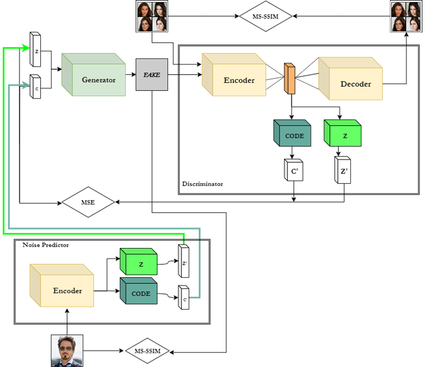
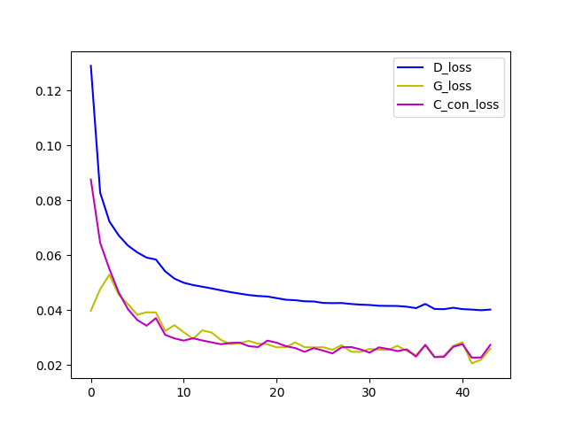

# Data Augmentation Powered by Generative Adversarial Network
## Our goal
Classical data augmentation techniques are not sufficient for facial recognition problems with small datasets. In
this paper we present our work aiming to develop generative models for data augmentation. We studied several
GANs that provide control over the features of the generated images, then implemented a model that can be
used for altering attributes of real images. We experimented with multiple architectures, and studied the effects of
certain loss functions and the practical limits of image recovery. Finally, we found, but did not come to thoroughly
examine great methods to improve the quality of the generated images. We aim to continue to develop our solution
with these methods and the experience gained from the project.

## Dependencies
* python 3.7
* pytroch 1.2.0
* pytroch_ssim 0.1
* cudnn 7.6.0
* tensorboard 2.0.0

## How to run script for training/predictor tuning
Use the Best Model from the 'DAPGAN implementation' folder :
```python
python Main2.py
```
To switch between training and tuning outcomment or change the code by opening it.

## Dataset
We are using the Celeba dataset and a significantly smaller dataset of Tony Stark to demonstrate the results. Our goal is to generate diverse images about Tony Stark for example different hair style, eye color, age, gender etc.
1. Celeba dataset (200K images):
* 50% --> Training data (training time reduction reasons)


2. Test dataset:
* any pictures we want to generate

## Network architecture

The original Information Maximization GAN (or InfoGAN for short, [1]) works
with concatenated code and noise vectors as input and has a modified loss
function to - besides other criteria - maximize the mutual information between
the input code and the
generated picture. The problem with this loss function is that mutual
information is hard to compute or even approximate.

Instead of directly including the mutual information in the loss of the
network, InfoGAN implementations often use an encoder network besides the
discriminator to recover the input code-and-noise vector (or latent vector).
This approach works because the information present in the input latent vector should
travel through the generator and the encoder to make the loss of the
resulting autoencoder smaller.

Using the additional encoder network has multiple
advantages: it simplifies the training process (eliminating the
approximation of mutual information) and the encoder can be used to
encode any picture one want to modify with the generator.
     
Our network uses this generator-discriminator-encoder approach with a small
modification: most layers of the discriminator is shared with the encoder
because the convolutions involved in processing the image would be the same
. This "shared" network has three output layer: one for discrimination, one
for recovering the code part of the latent vector and one for recovering
the noise part of the latent vector. Training is carried out in a
sequential manner: first we generate pictures and calculate loss
according to the "confusion" of the discriminator, then we train the
discriminator with real and fake images, and last we make an attempt
to recover the latent vector of the generated pictures and calculate
the loss of the encoder according to the difference between the input
vector and recovered one.

 
 After training, the encoder and the generator can be used as follows:
 * Feed the encoder with an image you want to modify. It will grant you the
  estimated latent vector of the image.
 * This latent vector - mostly the code part of it - can be modified and fed
  into the generator to get the modified image.<br/>
  

## Prototyping with MNIST

Because of the complexity of the above described architecture we started with
a simple dataset. After we built our networks we contructed a code part for
the latent vector: one categorical (one-hot encoded) component with ten
classes (hoping it will represent the digits after training) and two
continuously varying component.<br/>
<br/>
    
As one can see the network generates images with great quality. The
generator learned that the different digits can be easily mapped into the
categorical part of the code vector. The other two components captured
continuous variations in the dataset: the width and the angle of digits.<br/>

## Training with CelebA

After we achieved a useful mapping between image parameters and code
components with the MNIST dataset we moved to our original target, the
CelebA. With smaller modifications we managed to generate the results
presented below.


   
Some meaningful mapping between one of the continuous varying components
and the rotation of the faces can be seen but the results are not satisfying
yet. It seems that the migration from handwritten digits to human faces
needs more modification: we will try out different sets of categorical and
continuous code components to catch and map more aspects of the
underlying probability distribution into our code vector. An extended
hyperparameter optimization may also be needed to elevate the quality
of the generated images.

```
You can read about the full project and the aproaches we tested here:
``` 
[Paper](paper/Controlled_human_face_synthesis_with_Generative_Adversarial_Network.pdf)<br/>
```
Only the final result will be presented in the Readme.
```
## Info+BeGAN
After the effectively failed attempt of tailoring the InfoGAN
architecture to be more like BEGAN, we tried the other direction: implementing BEGAN and modifying it to meet our
goals. We extended an existing implementation with our previously developed predictor network.



(Our implemented structure’s losses during training)

Reconstructed Images:<br/>


## Results
The results were not as satisfying as we wanted. It seems the
InfoGAN architecture is focused only on the maximization
of the mutual information, and not to produce visually pleasing images. We also noticed that for a good prediction, the
Noise Predictor needs to have a Generator that can produce
images with good quality. Also, the resolution is important,
because we tried both 64×64 and 128×128 images, and the
bigger resolution led to better quality of reconstruction. At
this point, we had to handle a trade-off because generating
higher quality images demands significantly more compute
performance and training time. We trained our model with
a Nvidia TitanX P with 12GB GPU memory. We completed
more than 30 trainings and several of them were over 30
hours. Some parts of the result pictures contain the information what we want, but overall the generated images are not
usable for data augmentation yet.


