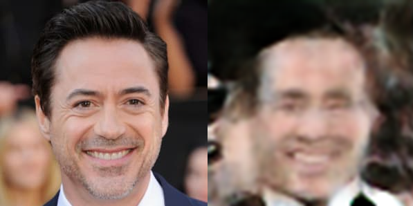

# Data Augmentation Powered by Generative Adversarial Network
## Our goal
We would like to aim data augmentation with GAN network structure. The plan is to implement an extended InfoGAN structure which is capable to generate diverse face images by auto fine tuning appropriate latent parameters.

## Dependencies
* python 3.7
* pytroch 1.2.0
* pytroch_ssim 0.1
* cudnn 7.6.0
* tensorboard 2.0.0

## How to run script for training/predictor tuning
Use the Best Model from the 'DAPGAN implementation' folder :
```python
python Main2.py
```
To switch between training and tuning outcomment or change the code by opening it.

## Dataset
We are using the Celeba dataset and a significantly smaller dataset of Tony Stark to demonstrate the results. Our goal is to generate diverse images about Tony Stark for example different hair style, eye color, age, gender etc.
1. Celeba dataset (200K images):
* 50% --> Training data (training time reduction reasons)


2. Test dataset:
* any pictures we want to generate

## Network architecture

The original Information Maximization GAN (or InfoGAN for short, [1]) works
 with concatenated code and noise vectors as input and has a modified loss
  function to - besides other criteria - maximize the mutual information between
   the input code and the
   generated picture. The problem with this loss function is that mutual
    information is hard to compute or even approximate.

Instead of directly including the mutual information in the loss of the
 network, InfoGAN implementations often use an encoder network besides the
  discriminator to recover the input code-and-noise vector (or latent vector).
   This approach works because the information present in the input latent vector should
    travel through the generator and the encoder to make the loss of the
     resulting autoencoder smaller.
  
  Using the additional encoder network has multiple
   advantages: it simplifies the training process (eliminating the
    approximation of mutual information) and the encoder can be used to
     encode any picture one want to modify with the generator.
     
Our network uses this generator-discriminator-encoder approach with a small
 modification: most layers of the discriminator is shared with the encoder
  because the convolutions involved in processing the image would be the same
  . This "shared" network has three output layer: one for discrimination, one
   for recovering the code part of the latent vector and one for recovering
    the noise part of the latent vector. Training is carried out in a
     sequential manner: first we generate pictures and calculate loss
      according to the "confusion" of the discriminator, then we train the
       discriminator with real and fake images, and last we make an attempt
        to recover the latent vector of the generated pictures and calculate
         the loss of the encoder according to the difference between the input
          vector and recovered one.
 
 
 After training, the encoder and the generator can be used as follows:
 * Feed the encoder with an image you want to modify. It will grant you the
  estimated latent vector of the image.
 * This latent vector - mostly the code part of it - can be modified and fed
  into the generator to get the modified image.
  

## Prototyping with MNIST

Because of the complexity of the above described architecture we started with
 a simple dataset. After we built our networks we contructed a code part for
  the latent vector: one categorical (one-hot encoded) component with ten
   classes (hoping it will represent the digits after training) and two
    continuously varying component.
    
    
 As one can see the network generates images with great quality. The
  generator learned that the different digits can be easily mapped into the
   categorical part of the code vector. The other two components captured
    continuous variations in the dataset: the width and the angle of digits.

## Training with CelebA

After we achieved a useful mapping between image parameters and code
 components with the MNIST dataset we moved to our original target, the
  CelebA. With smaller modifications we managed to generate the results
   presented below.
   
   
   
Some meaningful mapping between one of the continuous varying components
 and the rotation of the faces can be seen but the results are not satisfying
  yet. It seems that the migration from handwritten digits to human faces
   needs more modification: we will try out different sets of categorical and
    continuous code components to catch and map more aspects of the
     underlying probability distribution into our code vector. An extended
      hyperparameter optimization may also be needed to elevate the quality
       of the generated images.

## Results with Info+Be GAN


Reconstructed Images:



